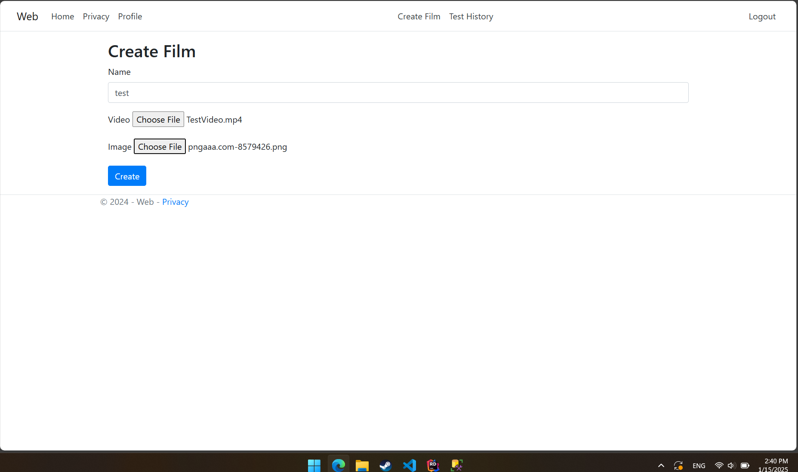
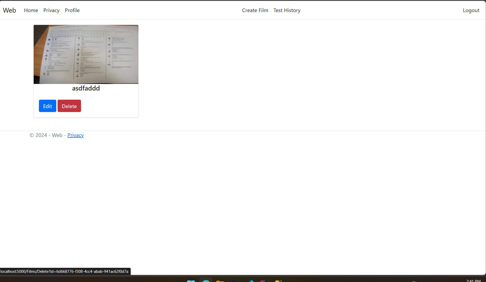

# Użytkowanie

## Logowanie

Użytkownik może się zalogować za pomocą hasła.

## Przeglądanie filmów

Przeglądanie filmów jest dostępne dla zalogowanych użytkowników.

## Dodawanie filmów

Dodawanie filmów jest dostępne tylko dla administratorów.

 

## Edycja filmów

Edycja filmów jest dostępna dla administratorów.

## Usuwanie filmów

Usuwanie filmów jest dostępna dla administratorów.

## Dodawanie pytan

Dodawanie pytan jest dostępna dla administratorów.

## Usuwanie pytan

Usuwanie pytan jest dostępna dla administratorów.

## Dodawanie Odpowiedzi

Dodawanie odpowiedzi jest dostępna dla administratorów.

## Usuwanie pytan

Usuwanie odpowiedzi jest dostępna dla administratorów.

## Testy

Testy są dostępne dla zalogowanych użytkowników.

## Konto użytkownika

Konto użytkownika jest dostępne dla zalogowanych użytkowników.

## Edycja konta użytkownika

Edycja konta użytkownika jest dostępna dla zalogowanych użytkowników.

## Test History

Test History jest dostępne dla zalogowanych użytkowników.

